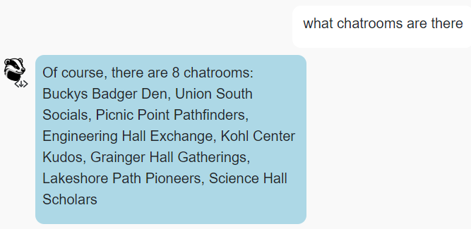
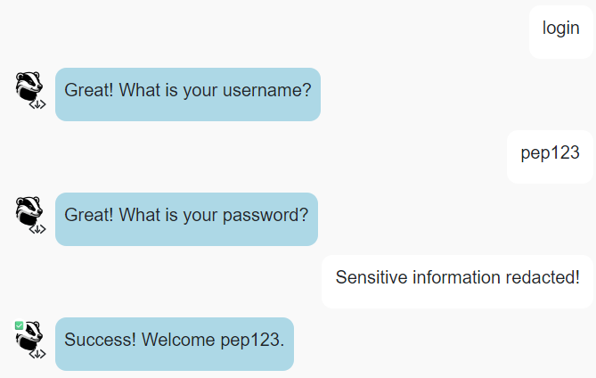

# CS571-S24 HW11: BadgerChat (Voice!)

Welcome back to our final installment of BadgerChat! For this assignment, you will re-implement BadgerChat as *a chat application*. By completing this class, you will have developed a web, mobile, and chat interface for BadgerChat! 🥳🎉 

**Please Note:** The speech-to-text transcription and text-to-speech synthesis are just for fun! They have already been implemented and do *not* need to be a part of your demo.

## Setup

You will complete a [Wit.AI Agent](https://wit.ai/) and some JS handler code as a part of this assignment.

The starter code provided to you was generated using [vite](https://vitejs.dev/guide/). Furthermore, [bootstrap](https://www.npmjs.com/package/bootstrap) and [react-bootstrap](https://www.npmjs.com/package/react-bootstrap) have already been installed. **You should *not* re-run the  npm create vite command**. Instead, in this directory, simply run...

```bash
npm install
npm run dev
```

Then, in a browser, open `localhost:5173`. You should *not* open index.html in a browser; React works differently than traditional web programming! When you save your changes, they appear in the browser automatically. I recommend using [Visual Studio Code](https://code.visualstudio.com/) to do your development work.

For this assignment, **you will only work on files within the `agent` folder**. You should **not** change the React JSX components; these have been completed for you! Your focus is to solely write the code in `agent` that interfaces between your [Wit.AI Agent](https://wit.ai/) and the provided React frontend.

## API Notes

All routes are relative to `https://cs571.org/api/s24/hw11/`

 - **This API has similar endpoints to HW6.**
 - **This API shares the same database as HW6 and HW9.**
 - **This API uses *cookies* for authentication.**
 - **This API does NOT paginate messages *nor* is a chatroom name required.**
   - Instead, a `chatroom` and max `num` of posts (up to 10) may optionally be specified.

See `API_DOCUMENTATION.md` for full details.

| Method | URL | Purpose | Return Codes |
| --- | --- | --- | --- |
| `GET`| `/chatrooms` | Get all chatrooms. | 200, 304 |
| `GET` | `/messages?chatroom=NAME&num=NUM`| Get latest `NUM` messages for specified chatroom. | 200, 400, 404 |
| `POST` | `/messages?chatroom=NAME` | Posts a message to the specified chatroom. | 200, 400, 404, 413 |
| `DELETE` | `/messages?id=ID` | Deletes the given message. | 200, 400, 401, 404 |
| `POST` | `/register` | Registers a user account. | 200, 400, 409, 413  |
| `POST` | `/login` | Logs a user in. | 200, 400, 401 |
| `POST` | `/logout` | Logs the current user out. | 200 |
| `GET` | `/whoami` | Gets details about the currently logged in user. | 200 |

**When making API calls with a request body, don't forget to include the header `"Content-Type": "application/json"`**

## Special Requirements
 - *Only* modify your Wit.AI agent and files within the `agent` folder. Do *not* modify any of the existing `.jsx` components.
 - While you may hardcode chatroom names as an entity of your Wit.AI agent, you may *not* hardcode them in your JavaScript code.
 - *Each* intent within your Wit.AI agent should be trained on **5+ utterances** 
   - Additionally, responses should be *varied*. Not every intent needs varied responses, but you should make use of `ofRandom` to vary your responses.
 - When `fetch`'ing data use the `async`/`await` syntax! Do not use `.then`.
 - When submitting your project, **please be sure to include a .ZIP of your Wit.AI agent!** Further instructions can be found underneath "Submission Details".

## BadgerMart

### 1. TITLE


### 2. TITLE



### 3. TITLE


### 4. TITLE


### 5. TITLE


### 6. TITLE


### 7. TITLE


### 8. TITLE


### 9. TITLE



### Submission Details

**BE SURE TO INCLUDE A COPY OF YOUR WIT.AI AGENT!** You can download this by visiting your `Wit.AI Project > Management > Settings > Export Your Data > Download .zip with your data`. Please commit and push this ZIP file as a part of your Git repository.

In addition to your code, **you will also need to submit a video recording of your app**. Like the demo video, it should cover all the tasks below. Please thoroughly demonstrate all tasks to showcase the capabilities of your app.

**Please embed your recording as a Kaltura video as a part of the assignment submission.** You may find [Zoom](https://support.zoom.us/hc/en-us/articles/201362473-Enabling-and-starting-local-recordings) helpful for recording your screen.

#### Tasks 
 - 